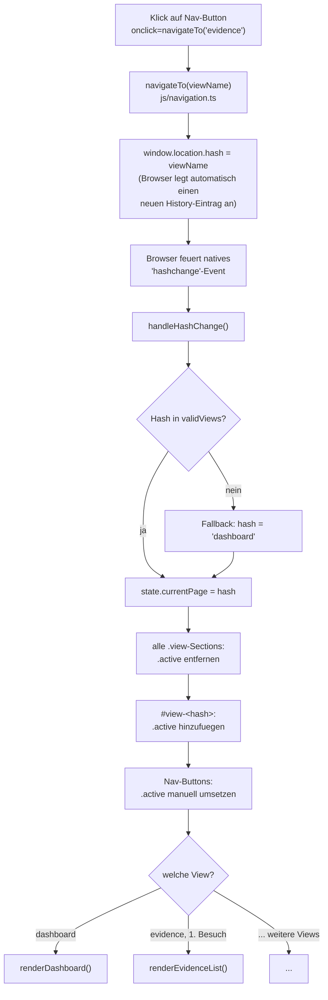

# UE3 CHANGES

Laufendes Änderungsprotokoll für Exercise 3 (React Foundations & First Migration).
Baut auf dem fertigen Stand von [`../ue2/UE2_CHANGES.md`](../ue2/UE2_CHANGES.md) auf (Vite +
TypeScript + CI/CD aus UE2 sind Voraussetzung). Migriert App-Shell + Dashboard-View nach React,
der Rest der App bleibt vorerst vanilla TS (kommt in UE4/UE5).

---

## Demo 1 — Historischer Überblick über die Web-Entwicklung

### 🔰 Einfach erklärt — worum geht's hier überhaupt?

Bevor wir React einführen, lohnt sich die Frage: **warum gibt es React (und Frameworks wie es)
überhaupt?** Die Antwort ist eine Geschichte, keine Design-Entscheidung aus dem Nichts — jede neue
Technik war die Antwort auf ein konkretes Problem der vorigen. Fünf grobe Epochen:

| Epoche | Ca. Zeitraum | Wie Interaktion funktionierte |
|---|---|---|
| **1. Statische Dokumente** | früh-/Mitte 1990er | Der Server schickt fertiges HTML. Jeder Klick auf einen Link = neue Anfrage, neue Seite, kompletter Neuaufbau. Keine "App", nur verlinkte Dokumente |
| **2. Serverseitig dynamisch generiert** | Mitte/Ende 1990er | HTML wird jetzt **pro Anfrage** vom Server zusammengebaut (CGI, PHP, ASP, JSP) — Inhalt kann sich unterscheiden (z. B. eingeloggter Nutzer), aber **jede** Interaktion ist immer noch ein kompletter Seiten-Neuladen |
| **3. AJAX / "Web 2.0"** | ab ca. 2004/2005 | JavaScript kann jetzt **im Hintergrund** nachfragen (`XMLHttpRequest`), ohne die Seite neu zu laden, und nur einen **Teil** der Seite aktualisieren. jQuery (2006) macht das browserübergreifend praktikabel. Seiten fühlen sich zum ersten Mal "lebendig" an (Gmail, Google Maps) |
| **4. SPA-Frameworks** | ab ca. 2010–2013 | Die **ganze Seite** wird zu einer einzigen, dauerhaft laufenden JS-Anwendung. Navigation passiert **client-seitig** (zuerst per URL-Hash, später per History-API), kein Seiten-Reload mehr überhaupt. Backbone.js, AngularJS, dann React (2013), Vue (2014) |
| **5. Hybride/moderne Architekturen** | ab ca. 2016 | Frameworks, die SPA-Interaktivität **mit** den SEO-/Ladezeit-Vorteilen von serverseitigem Rendering kombinieren (Next.js, Nuxt, …) — Thema in einer späteren Übung |

*Analogie:* Epoche 1 ist ein gedrucktes Buch (ganz neu drucken für jede Änderung). Epoche 2 ist ein
Drucker, der bei jeder Anfrage neu druckt, aber den Inhalt anpassen kann. Epoche 3 ist ein
Whiteboard, auf dem man einzelne Wörter austauschen kann, ohne alles neu zu schreiben. Epoche 4
ist ein digitales Whiteboard mit einem eingebauten Assistenten, der selbst herausfindet, welche
Wörter sich geändert haben und nur die austauscht.

### Task — wo steht unsere App auf dieser Zeitlinie, und warum?

**Unsere App gehört eindeutig in Epoche 4 (SPA), und zwar in deren frühe, handgestrickte Variante
— ohne Framework, mit Hash-Routing.**

Konkrete, beobachtbare Belege dafür:

| Merkmal in unserer App | Was das über die Einordnung aussagt |
|---|---|
| **Kein Backend überhaupt.** Der "Server" ist nur ein statischer Datei-Server (`vite preview`/GitHub Pages) — er generiert nichts, er liefert nur Dateien aus | Schließt Epoche 1+2 aus (dort generiert der Server aktiv HTML pro Anfrage) |
| **`fetch()` lädt JSON-Dateien im Hintergrund nach** (`js/data.ts`), ohne Seiten-Reload, aktualisiert dann nur Teile des DOM | Klassisches AJAX-Muster (Epoche 3) — aber... |
| **...es gibt gar keinen vollständigen Seiten-Reload zwischen Views, jemals.** Ein Klick auf "Evidence" tauscht nur den sichtbaren Abschnitt aus (`navigateTo()`/`handleHashChange()`, `js/navigation.ts`), die ganze Seite bleibt eine einzige, durchgehend laufende JS-Anwendung | Das ist der entscheidende Unterschied zu Epoche 3 — die **ganze** App ist eine Seite, nicht viele einzelne Server-Seiten mit AJAX-Häppchen obendrauf. Das ist Epoche 4: SPA |
| **`#dashboard`, `#evidence`, ... als URLs** (`window.location.hash`) statt echter Pfade wie `/dashboard` | Genau das Hash-Routing-Muster, das **vor** der breiten Nutzung der History-API üblich war (siehe Theorie-F2 unten) — architektonisches Kennzeichen der **frühen** SPA-Ära, ca. 2010–2014 |
| **Kein Framework, kein Router, kein Zustands-Management** — alles handgeschrieben (`state.ts` als einfaches Objekt, `if`-Kette in `handleHashChange()`) | Genau das Muster, das Teams **vor** der Verbreitung von Backbone/Angular/React selbst bauen mussten, weil es noch keine Standard-Lösung dafür gab |

**Einordnung:** die App ist zwar erst kürzlich für diesen Kurs geschrieben worden, reproduziert
aber bewusst-unbewusst exakt das architektonische Muster einer **frühen, vor-Framework-SPA** (ca.
2010–2014) — technisch das, was ein Team damals hätte bauen müssen, weil React/Vue/ein
ausgereifter Router noch nicht existierten oder noch nicht verbreitet waren. Das macht sie zum
idealen Ausgangspunkt für diese Übung: Demo 6–10 migrieren genau diese handgestrickten Teile
(Routing, Rendering) zu dem, was Epoche 4 später standardisiert hat — React.

### Verifikation
Kein Code geändert (reine Konzept-/Einordnungs-Demo). Belege oben direkt aus bestehenden Dateien
abgeleitet (`js/navigation.ts`, `js/data.ts`, `js/state.ts`).

### 🎤 Live-Demo — was du im Unterricht herzeigst

**1. Die Tabelle/Zeitlinie zeigen**, kurz durchgehen, den einen Satz sagen: "jede neue Technik war
die Antwort auf ein konkretes Problem der vorigen — kein Zufall, keine Mode."

**2. Live an der eigenen App zeigen, warum sie Epoche 4 ist**
DevTools → Network-Tab öffnen, zwischen zwei Views klicken (z. B. Dashboard → Evidence). Zeig: **kein
neuer Dokument-Request** in der Liste — nur ggf. `data/*.json`, falls noch nicht geladen. Sag: "kein
einziger voller Seiten-Reload, obwohl sich die URL (`#evidence`) ändert."

**3. `js/navigation.ts` kurz aufmachen**
Zeig `handleHashChange()` — die `if`/`else if`-Kette, die manuell entscheidet, was gerendert wird.
Sag: "das ist genau die Handarbeit, die ein Framework wie React später standardisiert."

---

## Demo 2 — SSR vs. CSR

### 🔰 Einfach erklärt — worum geht's hier überhaupt?

**SSR (Server-Side Rendering)** heißt: der Server baut das **fertige** HTML mit den echten
Inhalten und schickt es so. **CSR (Client-Side Rendering)** heißt: der Server schickt nur ein
fast leeres HTML-Gerüst + JavaScript, und **der Browser selbst** baut daraus erst den eigentlichen
Inhalt zusammen, per Code.

*Analogie:* SSR ist ein Restaurant, das dir ein **fertig gekochtes** Gericht bringt. CSR ist ein
Restaurant, das dir eine **Kochbox mit rohen Zutaten und einem Rezept** bringt — du (der Browser)
musst erst selbst kochen, bevor überhaupt etwas Essbares auf dem Tisch steht.

### Task 1 — Vergleichstabelle

| | **SSR** | **CSR** |
|---|---|---|
| **Was der Server bei der ersten Anfrage schickt** | vollständiges HTML, **bereits mit echten Inhalten gefüllt** — Text ist sofort da, sobald das HTML ankommt | ein fast leeres HTML-"Gerüst" (oft nur ein `<div id="root"></div>`) + Links auf JS-/CSS-Dateien — der eigentliche Inhalt fehlt komplett |
| **Was der Browser tun muss, BEVOR Inhalt sichtbar ist** | nur: HTML empfangen und parsen — Inhalt ist von Anfang an im HTML enthalten | HTML laden → JS-Datei(en) laden → JS parsen und ausführen → JS baut den DOM selbst zusammen (oft erst nach eigenem Nachladen von Daten) |
| **Was bei nachfolgender Navigation passiert** | klassisch: komplett neue Anfrage an den Server, komplett neue HTML-Antwort (moderne SSR-Frameworks mischen das oft mit späterer clientseitiger Navigation) | **keine** neue Anfrage für die Seite selbst — JS tauscht nur den betroffenen DOM-Teil aus, lädt bei Bedarf nur neue **Daten** nach (nicht die ganze Seite) |

### Task 2 — echte Webseite, mit beobachtbarem Beweis eingeordnet

**Wikipedia = SSR.** Live per Browser-Tools geprüft (nicht nur behauptet): die Netzwerk-Antwort auf
die erste Anfrage einer Artikelseite (`en.wikipedia.org/wiki/Single-page_application`) ist ein
vollständiges HTML-Dokument, das bereits die komplette Seitenstruktur (Kopfzeile, Navigation,
Artikel-Gerüst) enthält — **kein** leeres `<div id="root">`. Zwei konkrete, direkt im HTML sichtbare
Belege:

1. Das `<html>`-Tag trägt von Anfang an die Klasse **`client-nojs`** — ein Fallback-Zustand, den
   MediaWiki (Wikipedias Software) extra für Besucher:innen **ohne** JavaScript pflegt. Eine
   Software würde sich diese Mühe nicht machen, wenn die Seite ohne JS gar nicht funktionieren
   würde (klassisches CSR-Verhalten) — das ist ein starkes Indiz, dass der eigentliche Inhalt schon
   ohne JS da ist.
2. `<meta name="generator" content="MediaWiki 1.47.0-wmf.21">` — der Server selbst hat dieses HTML
   gerade eben, für genau diese Anfrage, aus einer Wiki-Datenbank **serverseitig generiert**.

Ein direkter Blick in den restlichen HTML-Body (nicht in dieser Doku abgedruckt, im Netzwerk-Tab
selbst nachvollziehbar) zeigt: der komplette Artikeltext ist bereits Teil dieser ersten Antwort.

### Verifikation
Task 2 live über die Browser-Netzwerk-Antwort geprüft (kein reines "sollte SSR sein" aus dem
Gedächtnis) — siehe Belege oben.

### 🎤 Live-Demo — was du im Unterricht herzeigst

**1. Wikipedia als SSR-Beweis**
`en.wikipedia.org` auf einen beliebigen Artikel, `F12` → Network-Tab → die erste Dokument-Anfrage
anklicken → Response-Tab. Zeig: der komplette Artikeltext steht schon im rohen HTML, **bevor**
irgendein JS gelaufen ist. Zeig `class="client-nojs"` im `<html>`-Tag.

**2. Unsere App als CSR-Gegenbeweis**
Unsere deployte GitHub-Pages-URL öffnen, `F12` → Network-Tab, Seite neu laden. Zeig: die erste
Dokument-Antwort (`index.html`) ist **winzig** im Vergleich — öffne sie im Response-Tab, zeig,
dass z. B. `<div id="evidenceList" class="evidence-grid"></div>` **leer** ist. Zeig danach die
JS-Datei (`assets/index-*.js`) und die nachfolgenden `data/*.json`-Requests — "der Inhalt kommt
hier komplett separat, nach dem HTML, über JavaScript."

---

## Demo 3 — Der virtuelle DOM

### 🔰 Einfach erklärt — worum geht's hier überhaupt?

**Was ist der virtuelle DOM, in eigenen Worten?** Eine **leichtgewichtige, rein in JavaScript
gehaltene Kopie** dessen, wie der echte DOM aussehen soll — ein Baum aus einfachen
JavaScript-Objekten, kein einziges echtes Browser-Element dabei. Ändert sich etwas, baut die
Bibliothek (z. B. React) eine **neue** solche Kopie, **vergleicht** sie mit der **vorigen** Kopie
("diffing") und findet dabei genau heraus, was sich wirklich unterscheidet. Erst **dann** werden
am echten DOM nur genau die Stellen angefasst, die sich tatsächlich geändert haben.

*Analogie:* Stell dir einen 50-seitigen gedruckten Bericht vor, bei dem sich auf **einer** Seite
ein Tippfehler geändert hat. Unser aktueller Ansatz (`innerHTML = ...`) ist: den **kompletten**
Bericht neu drucken und komplett austauschen — auch wenn 49 von 50 Seiten identisch geblieben
sind. Der virtuelle-DOM-Ansatz ist: zuerst eine **billige Wegwerf-Kopie** (auf Schmierpapier, nicht
gedruckt) von "wie soll der Bericht jetzt aussehen" anfertigen, Seite für Seite mit der alten
Wegwerf-Kopie vergleichen, feststellen "nur Seite 47 unterscheidet sich" — und **nur diese eine
Seite** im echten, gedruckten Bericht austauschen.

**Welches Problem löst das?** Direkte DOM-Manipulation hat vorher zwei unschöne Optionen gehabt:
entweder **von Hand ganz genau** aufschreiben, welches einzelne Element sich wie ändern soll
(präzise, aber mühsam, fehleranfällig, wird bei komplexer UI schnell unübersichtlich), oder **den
einfachen Weg** gehen und einfach den ganzen betroffenen Bereich neu zusammenbauen
(`innerHTML = ganzerNeuerString` — simpel zu schreiben, aber verschwenderisch: zerstört und baut
weit mehr DOM neu, als nötig wäre). Der virtuelle DOM gibt beides zugleich: man schreibt einfachen,
deklarativen Code ("so soll die Komponente aussehen, als würde sie immer von Null gezeichnet"),
bekommt aber effiziente, chirurgisch genaue Updates am echten DOM automatisch — weil der
Diffing-Schritt selbst herausfindet, was minimal geändert werden muss.

### Task — konkretes Beispiel im ORIGINALEN `app.js` (vor UE1)

**Gefunden in `app.js`, Zeilen 434–449 (`handleBookmarkClick`) + 369–394 (`renderEvidenceList`):**

```js
function handleBookmarkClick(evidenceId) {
  var ev = findEvidenceById(evidenceId);
  if (!ev) return;
  if (bookmarks.indexOf(evidenceId) === -1) {
    bookmarks.push(evidenceId);
    ev.bookmarked = true;
  } else {
    bookmarks = bookmarks.filter(function (id) { return id !== evidenceId; });
    ev.bookmarked = false;
  }
  saveBookmarksToStorage();
  if (currentPage === "evidence") renderEvidenceList();   // <- das komplette Grid!
}

function renderEvidenceList() {
  // ...
  var results = getFilteredEvidence();
  var html = "";
  for (var i = 0; i < results.length; i++) {
    html += renderEvidenceCardHTML(results[i]);   // <- ALLE Karten neu gebaut
  }
  container.innerHTML = html;   // <- kompletter Grid-Inhalt ersetzt
}
```

**Was hier passiert, wenn man EIN Lesezeichen anklickt:** `bookmarks`-Array ändert sich um genau
**einen** Eintrag. Aber `handleBookmarkClick` ruft danach `renderEvidenceList()` auf — und die
baut **alle** gefilterten Beweisstücke (bis zu 18 Karten) komplett neu als HTML-String zusammen
(`renderEvidenceCardHTML()` für **jede einzelne** Karte, nicht nur die betroffene) und ersetzt mit
`container.innerHTML = html` den **kompletten** Inhalt des Grids auf einmal. Tatsächlich geändert
hätte sich nur: ein Stern-Symbol (★ statt ☆) und eine CSS-Klasse (`active`) an **einem einzigen**
Button in **einer einzigen** Karte.

*(Derselbe Musterfehler steckt übrigens bis heute auch in der aktuellen TypeScript-Version —
`views/evidence.ts`s `handleBookmarkClick` ruft ebenfalls die volle `renderEvidenceList()` auf. Der
UE1-Refaktor hat nur Dateien aufgeteilt, nicht die Render-Strategie geändert — genau das ist der
Teil, den React/der virtuelle DOM jetzt lösen soll.)*

### Verifikation
Kein Code geändert (Konzept-Demo). Beispiel direkt im Original-Quelltext (`app.js`) verifiziert,
Zeilennummern oben zitiert.

### 🎤 Live-Demo — was du im Unterricht herzeigst

**1. `app.js` aufmachen, Zeile 448 zeigen**
`if (currentPage === "evidence") renderEvidenceList();` — sag: "ein Klick auf EINEN Stern ruft das
auf, was die KOMPLETTE Liste neu baut."

**2. Live im Browser beweisen**
Deployte App öffnen (oder `npm run dev`), Evidence-View, DevTools → Elements-Tab, ein Beweisstück-
Karten-Element im DOM-Baum aufklappen/markieren. Auf den Bookmark-Stern klicken. Zeig: im
Elements-Tab **blinkt kurz die komplette Liste** (Chrome hebt neu eingefügte DOM-Knoten farblich
hervor) — nicht nur die eine Karte.

---

## Demo 4 — SPA vs. MPA: State & Routing

### 🔰 Einfach erklärt — worum geht's hier überhaupt?

Bei einer klassischen Multi-Page-App (MPA) ist **jede Seite ein eigener, kompletter Neustart** —
der Browser weiß zwischen zwei Seiten praktisch nichts mehr von sich selbst. Bei einer SPA wie
unserer App gibt es dagegen **eine einzige, durchgehend laufende** JavaScript-Umgebung, die sich
alles selbst merkt — bis sie durch einen echten Reload beendet wird. Demo 4 zeigt genau, **wie**
das bei uns technisch funktioniert und was das für Konsequenzen hat.

### Task 1 — wie Navigation aktuell funktioniert (Diagramm)



**Was dabei NICHT passiert** (im Unterschied zu einer klassischen Mehrseiten-Site):

| Passiert NICHT | Würde bei einer klassischen MPA passieren |
|---|---|
| Keine neue HTTP-Anfrage für ein neues Dokument | Browser fordert eine komplett neue HTML-Seite vom Server an |
| Kein voller Seiten-Reload (kein weißes Aufblitzen) | Seite wird komplett verworfen und neu aufgebaut |
| DOM außerhalb der getauschten Section bleibt unangetastet (Header, Nav bleiben exakt dieselben Elemente) | der komplette DOM wird neu erzeugt, jedes Element ist danach ein neues Objekt |
| Der JS-Ausführungskontext (`state`-Objekt im Speicher) läuft einfach weiter | jeglicher JS-Zustand ist weg, jedes `<script>` startet komplett neu |

### Task 2 — jedes Stück Zustand: übersteht einen vollen Reload oder nicht?

| Zustand | Wo gespeichert | Übersteht `F5` (vollen Reload)? |
|---|---|---|
| `bookmarks` (welche Beweisstücke markiert sind) | `localStorage` (`remotion_bookmarks`) | ✅ ja |
| `notesStore` (private Notizen pro Beweisstück) | `localStorage` (`remotion_notes`) | ✅ ja |
| Hypothesen-Entwurf (Workspace-Formular) | `localStorage` (`remotion_hypothesis`) — aber **nur**, wenn "Save hypothesis draft" geklickt wurde | ✅ ja, aber nur der zuletzt **gespeicherte** Stand |
| `allEvidence`/`allPeople`/`allLocations`/`allTimeline`/`caseData` | nur im Speicher (`state.ts`) | ⚠️ technisch weg, wird aber beim Neustart aus denselben JSON-Dateien **neu geladen** — für die Nutzer:in nicht sichtbar unterschiedlich |
| `selectedEvidence` (welches Beweisstück-Detail gerade offen ist) | nur im Speicher | ❌ nein — Detail-Ansicht ist nach Reload zu |
| `currentPeopleTab` (People- vs. Locations-Tab) | nur im Speicher | ❌ nein — springt zurück auf "People" |
| `viewRendered`-Flags (Erstbesuch-Render-Cache) | nur im Speicher | ❌ nein, aber irrelevant — sind nach Neustart ohnehin wieder alle `false` |
| aktuelle Filter-/Such-Eingaben (Textfeld, Dropdowns) | nur im DOM (Formularwerte) | ❌ nein — alle Filter zurückgesetzt |
| ungespeicherter Text in einem Notiz-/Hypothesen-Feld (getippt, aber "Save" nicht geklickt) | nur im DOM | ❌ nein — komplett weg |
| `state.currentPage` (welche View gerade sichtbar ist) | **im URL-Hash** (`#evidence`) | ✅ ja — weil der Hash Teil der URL ist, nicht Teil des JS-Speichers |
| Scroll-Position | Browser-Standardverhalten | ❌ nein (kein App-spezifisches Verhalten) |

### Verifikation
Zurück-Button-Verhalten (Grundlage für Theorie-F3) live in der deployten App geprüft: Dashboard →
Evidence (`#evidence`, neuer History-Eintrag) → Beweisstück-Detail geöffnet (Hash bleibt
unverändert auf `#evidence`, **kein** neuer History-Eintrag) → Zurück-Button gedrückt → Ergebnis:
Sprung direkt zurück auf die Wurzel-URL (Dashboard), **nicht** zurück zur Evidence-Liste mit
geschlossenem Detail. Zusätzlich separat geprüft: reines View-zu-View-Wechseln (Dashboard →
Evidence → Zurück) funktioniert korrekt und landet wieder auf Dashboard.

### 🎤 Live-Demo — was du im Unterricht herzeigst

**1. Das Diagramm zeigen**, einmal laut durchgehen, den Kontrast-Satz sagen: "keine einzige neue
Seiten-Anfrage in der ganzen Kette."

**2. Live: DevTools-Network-Tab, ein paar Views durchklicken**
Zeig: **keine** neuen Dokument-Requests in der Liste, nur die URL in der Adresszeile ändert sich.

**3. Live: den Zurück-Button-Bug vorführen**
Dashboard → Evidence klicken → ein Beweisstück öffnen (Detail-Ansicht) → Browser-Zurück-Button
drücken. Zeig: man landet **nicht** auf der Evidence-Liste mit geschlossenem Detail, sondern
direkt zurück auf dem Dashboard — "ein Klick zurück hat zwei Schritte übersprungen." Erklär kurz:
"weil das Öffnen des Details nie die URL geändert hat, gab's dafür nie einen eigenen
History-Eintrag."

**4. Live: `localStorage` vs. Reload zeigen**
Ein Beweisstück bookmarken, DevTools → Application → Local Storage zeigen (`remotion_bookmarks`
enthält die ID). Seite mit `F5` neu laden — Bookmark ist noch da. Dann eine Notiz in ein Textfeld
tippen, **ohne** zu speichern, `F5` drücken — Text ist weg.

---

## Demo 5 — React-Einführung

### 🔰 Einfach erklärt — worum geht's hier überhaupt?

Bevor React überhaupt ins Projekt kommt (das ist erst Demo 6), geht's hier nur darum, JSX einmal
wirklich **selbst geschrieben und verstanden** zu haben — noch in keiner echten App, nur zum
Beweis, dass man's kann und weiß, was dabei technisch passiert.

### Task 1 — eine winzige, statische JSX-Komponente

Kein State, keine Props — nur eine feste Zeile Text als JSX, exakt wie gefordert:

```tsx
function CaseSummaryCard() {
  return (
    <div className="case-summary">
      <h2>Project ReMotion</h2>
      <p>Investigate the failure of an AI-assisted rehabilitation robot.</p>
    </div>
  );
}
```

Das ist eine ganz normale JavaScript-Funktion — sie nimmt nichts entgegen (keine Parameter) und
gibt etwas zurück, das aussieht wie HTML, aber **kein** HTML-String ist (dazu mehr bei Theorie F1).

### Task 2 — was "Komponente" bedeutet, in eigenen Worten, im Vergleich zu `renderEvidenceCardHTML()`

**In eigenen Worten:** eine React-**Komponente** ist eine Funktion, die eine **Beschreibung** der
Oberfläche zurückgibt — eine Struktur, die React selbst versteht und aktiv verwaltet (Tag,
Attribute, Kinder als echte JS-Objekte). Das ist etwas **grundlegend anderes** als eine Funktion,
die einfach zufällig HTML-artigen **Text** zurückgibt.

**Der Unterschied zu `renderEvidenceCardHTML(ev)`** (aus dem originalen `app.js`, UE3 Demo 3):
diese Funktion baut einen HTML-**String** zusammen (`"<div class=\"evidence-card\">..." + ... `) —
für JavaScript ist das Ergebnis einfach eine Zeichenkette, bedeutungslos, bis irgendjemand sie
später per `container.innerHTML = html` an den Browser übergibt. Der Browser muss diesen String
dann komplett **neu parsen** und daraus **komplett neue** DOM-Elemente erzeugen — er hat keine
Ahnung, was vorher an dieser Stelle stand, er sieht nur "hier ist neuer Text, bau das". Eine
React-Komponentenfunktion gibt dagegen **kein** Text zurück, sondern ein **Objekt** (bzw. einen
Baum aus Objekten), das React strukturell versteht: "ein `div`, mit diesen Attributen, mit diesen
Kindern" — und genau das ist die Grundlage für das Diffing aus Demo 3: React kann dieses Objekt
mit dem vorigen vergleichen, **ohne** jemals einen String zu parsen.

*Analogie:* `renderEvidenceCardHTML()` schreibt einen Brief in Fließtext ("Liebe:r Browser, bau
bitte einen Div mit dieser Klasse…") — der Empfänger muss den ganzen Brief lesen und interpretieren.
Eine React-Komponente füllt stattdessen ein **strukturiertes Formular** aus (Feld "Tag": `div`,
Feld "Attribute": `{...}`, Feld "Kinder": `[...]`) — der Empfänger kann einzelne Felder direkt
auslesen und vergleichen, ohne erst einen ganzen Text zu verstehen.

### Verifikation
Kein Code im Projekt geändert (Task 1 ist bewusst "throwaway", noch keine React-Installation —
das ist Demo 6). Die Komponente oben ist syntaktisch gültiges JSX/TSX, mental gegen die
Transformation in Theorie-F1 durchgespielt.

### 🎤 Live-Demo — was du im Unterricht herzeigst

**1. Die winzige Komponente zeigen**, laut vorlesen: "eine ganz normale Funktion, gibt aber kein
Text zurück, sondern JSX."

**2. Direkt daneben `renderEvidenceCardHTML()` aus `app.js` aufmachen**
Zeig die `html += "..."`-Zeilen. Sag den einen Satz: "das ist ein String-Fließband, meine
Komponente oben ist ein ausgefülltes Formular — beides beschreibt am Ende denselben `div`, aber auf
völlig unterschiedliche Art."

---

## Demo 6 — React + TypeScript Entry Point im Vite-Projekt

### 🔰 Einfach erklärt — worum geht's hier überhaupt?

Ab hier ist React nicht mehr nur Theorie — es steckt jetzt wirklich im Projekt, **parallel** zur
bestehenden, voll funktionsfähigen vanilla-App. Nichts an der alten App wurde angefasst oder
entfernt — React lebt komplett eigenständig daneben, erreichbar über eine zweite Seite.

### Task 1 — React + TypeScript ins Vite-Projekt geholt

| Installiert | Art | Wofür |
|---|---|---|
| `react`, `react-dom` | `dependencies` (läuft im Browser mit) | React selbst + die Funktionen, die React-Elemente tatsächlich ins echte DOM schreiben |
| `@vitejs/plugin-react` | `devDependencies` (nur beim Bauen/Entwickeln) | übersetzt JSX/TSX (per esbuild) und bringt Fast-Refresh (HMR für Komponenten, UE2 Demo 2) |
| `@types/react`, `@types/react-dom` | `devDependencies` | TypeScript-Typdefinitionen für React selbst (React-Quellcode ist reines JS, `@types/*` liefert die `.d.ts`-Beschreibung nach, damit `tsc` React-Aufrufe typprüfen kann) |

**`vite.config.js`**: `react()`-Plugin eingebunden. Zusätzlich `build.rollupOptions.input` mit
**zwei** Einträgen (`index.html` + `react.html`) — ohne das würde `vite build` nur `index.html`
mitnehmen, `react.html` würde im späteren Deploy (`dist/`) schlicht fehlen.

**`tsconfig.json`**: `"jsx": "react-jsx"` ergänzt (die automatische JSX-Transformation, siehe
UE3 Demo 5 F1), `include` um `src/**/*.tsx`/`src/**/*.ts` erweitert.

### Task 2 — minimaler Einstiegspunkt, sichtbar, ohne die vanilla-App zu entfernen

Drei neue Dateien:

| Datei | Rolle |
|---|---|
| `react.html` (Projekt-Root, neben `index.html`) | eigene, **komplett separate** HTML-Seite — eigener `<div id="react-root">`, eigenes `<script type="module" src="/src/main.tsx">`. Nutzt dasselbe `styles.css` (gleiche Optik), aber sonst nichts Gemeinsames mit `index.html` |
| `src/main.tsx` (neu) | React-Bootstrap: `createRoot(rootElement).render(<StrictMode><App /></StrictMode>)` |
| `src/App.tsx` (neu) | die Root-Komponente selbst — noch ein reiner Platzhalter, kein Shell/Routing (kommt Demo 9), kein Dashboard (kommt Demo 10) |

Live geprüft (`npm run dev`): `/react.html` zeigt die React-Platzhalterseite, **0 Konsolenfehler**.
`/` (die bestehende vanilla-App) läuft **unverändert weiter** — 18 Evidenz-Einträge, alle Stats,
alle Views, exakt wie vor dieser Demo.

### Task 3 — wie koexistieren vanilla und React während der Migration, und warum?

**Entscheidung: zwei komplett getrennte HTML-Einstiegspunkte** (`index.html` = vanilla, `react.html`
= React) statt eines gemeinsamen Einstiegspunkts mit Laufzeit-Umschaltung (z. B. ein Query-Parameter
`?react=1`, der zur Laufzeit entscheidet, welche App gemountet wird).

**Warum diese Variante:**
- **Null Interferenz-Risiko.** Die vanilla-App hat ihr eigenes globales `state`-Objekt, hängt
  Funktionen an `window` (UE2 Demo 7), registriert `hashchange`-Listener. Liefen beide Apps auf
  derselben Seite (auch nur eine davon "inaktiv" im Hintergrund), müsste man aktiv verhindern, dass
  sich beide in die Quere kommen (doppelte `window`-Zuweisungen, doppelte Listener). Mit zwei
  komplett getrennten Seiten lädt **immer nur eine** App überhaupt, die andere existiert für diesen
  Seitenaufruf schlicht nicht.
- **Einfachstes Nebeneinander für Vergleich/Präsentation.** "Hier die alte, hier die neue" ist ein
  Klick (bzw. eine URL) auseinander — ideal für die Live-Demo, wenn man beide Stände direkt
  gegenüberstellen will.
- **Kein zusätzliches Werkzeug nötig.** Vite unterstützt mehrere `.html`-Einstiegspunkte
  ("Multi-Page-App") von Haus aus — nur der `rollupOptions.input`-Eintrag oben war nötig, keine
  Extra-Bibliothek.

**Was mit der Gegenrichtung schiefgehen würde:** eine Laufzeit-Umschaltung in **einem** gemeinsamen
`index.html` würde bedeuten, dass **beide** Apps' JS potenziell im selben Bundle/derselben Seite
landen — auch wenn nur eine "sichtbar" gemountet ist, könnte z. B. `js/main.ts`s
`window.navigateTo = ...`-Zuweisungen (UE2 Demo 7) weiterhin laufen und mit React um denselben
`window`-Namespace konkurrieren, oder beide Apps' `DOMContentLoaded`-Listener gleichzeitig feuern.
Das wäre zusätzliche, unnötige Komplexität genau in der Phase, wo man am wenigsten Überraschungen
will — und würde spätestens beim endgültigen Ablösen (Demo 9/10 baut die echte Shell) wieder
aufgeräumt werden müssen.

### Verifikation
`npm run typecheck` → 0 Fehler. `npm run dev`: `/react.html` rendert die Platzhalter-Komponente,
Konsole leer; `/` (vanilla) läuft unverändert (18 Evidenz-Karten, Dashboard-Stats, alle 5 Views) —
beide live im Browser geprüft, nicht nur angenommen. `npm run build` bestätigt zusätzlich, dass
`rollupOptions.input` wirklich greift: `dist/react.html` **und** `dist/index.html` werden beide
erzeugt, dazu ein eigenes `react-*.js`-Bundle (React + ReactDOM, 219 KB gzip: 69 KB) getrennt vom
bestehenden `main-*.js` (20 KB, die vanilla-App) — React bringt spürbar mehr Grundgewicht mit,
genau das Trade-off-Thema aus Demo 8 (ADR: warum SPA/React).

### 🎤 Live-Demo — was du im Unterricht herzeigst

**1. Beide Seiten nebeneinander zeigen**
`npm run dev`, zwei Tabs: einmal `/` (vanilla, voll funktionsfähig), einmal `/react.html`
(React-Platzhalter). Sag: "beide laufen gleichzeitig, komplett unabhängig voneinander, vom selben
Vite-Dev-Server ausgeliefert."

**2. `src/App.tsx` + `src/main.tsx` kurz zeigen**
Sag den einen Satz: "`main.tsx` ist das Spiegelbild von `js/main.ts` — aber für React, komplett
eigenständig, importiert nichts aus dem alten Code."

**3. `vite.config.js` zeigen, auf `rollupOptions.input` zeigen**
Sag: "ohne diese zwei Zeilen würde `react.html` beim Produktions-Build einfach fehlen — Vite baut
sonst nur die Hauptseite."

---

## Demo 7 — Komponenten-Hierarchie für die gesamte App

### 🔰 Einfach erklärt — worum geht's hier überhaupt?

Bevor wirklich Code entsteht (Demo 9/10), lohnt sich ein **Bauplan für die ganze App** — nicht nur
für das Dashboard, das diese Übung tatsächlich baut, sondern für alle 5 Views, obwohl die meisten
erst in UE4/UE5 dran sind. Ein Bauplan jetzt verhindert, dass man sich später in eine Ecke
programmiert (mehr dazu in Theorie-F3).

### Task 1+2 — Diagramm + Props/Daten für ≥5 Komponenten

Eigene, dedizierte Datei wegen des Umfangs:
**[`UE3_DEMO7_COMPONENT_HIERARCHY.md`](UE3_DEMO7_COMPONENT_HIERARCHY.md)**

Kurzer Überblick über die Struktur:

| Ebene | Beispiele |
|---|---|
| **Shell** (Demo 9) | `App`, `Header`, `NavBar`, `NavButton`, `PageRouter` |
| **Seiten** (eine pro aktueller View) | `DashboardPage` (★ diese Übung), `EvidencePage`, `PeoplePage`, `TimelinePage`, `WorkspacePage` (alle UE4/UE5) |
| **Seiten-spezifische Bausteine** | `StatCard`, `EvidenceGrid`, `PersonCard`, `TimelineEventItem`, `HypothesisForm`, … |
| **Wiederverwendbare Bausteine** (über mehrere Seiten hinweg genutzt) | `Badge`, `BookmarkButton`, `TagChip`, `Button`, `MiniListItem`, `Modal`, `LoadingSpinner` |

Props/Daten-Tabelle für 6 konkrete Komponenten (`StatCard`, `EvidenceCard`, `Badge`,
`BookmarkButton`, `NavButton`, `HypothesisForm`) steht in der verlinkten Datei.

### Verifikation
Kein Code geändert (reine Design-/Diagramm-Demo). Diagramm ist gültiges Mermaid-Markdown (rendert
direkt auf GitHub).

### 🎤 Live-Demo — was du im Unterricht herzeigst

**1. Das Diagramm auf GitHub zeigen** (rendert automatisch als Grafik, kein Screenshot nötig).
Einmal die 4 Ebenen benennen: Shell → Seiten → seiten-spezifische Bausteine → wiederverwendbare
Bausteine.

**2. Auf die gestrichelten Linien zeigen**
Sag: "`Badge` taucht an drei Stellen im Baum auf — Evidence-Karte, Evidence-Detail, Timeline —
aber es ist überall **dieselbe** Komponente, keine drei Kopien."

**3. Bezug zur Doku-Tabelle**
Ein, zwei Zeilen aus der Props-Tabelle vorlesen, den einen Satz sagen: "jede Komponente bekommt
genau die Daten, die sie braucht, als Props von oben — sie sucht sich nichts selbst global
zusammen."

---

## Demo 8 — Architecture Decision Record: warum SPA/React

### 🔰 Einfach erklärt — worum geht's hier überhaupt?

Ein **ADR (Architecture Decision Record)** ist ein Standard-Dokumentformat aus der echten
Software-Entwicklung: eine Architektur-Entscheidung wird **schriftlich begründet**, **inklusive
der Nachteile** — nicht nur eine Liste von Vorteilen. Der Sinn: in einem Jahr soll jemand (auch
man selbst) nachlesen können, *warum* damals so entschieden wurde, nicht nur *was* entschieden
wurde.

### Task 1+2 — Argumentation + ehrliche Nachteile

Eigene Datei, im Standard-ADR-Format (Kontext → Entscheidung → Begründung → Nachteile →
Konsequenz → betrachtete Alternativen):
**[`UE3_DEMO8_ADR_SPA_REACT.md`](UE3_DEMO8_ADR_SPA_REACT.md)**

Kurzüberblick über die Argumentation:

| | Kernaussage |
|---|---|
| **Warum SPA für diese App** | die zentrale Interaktion (ständiges Kreuzverweisen zwischen Views) ist genau das, was SPA am besten kann; Daten sind klein/statisch, kein echter SEO-Bedarf |
| **Warum React speziell** | beseitigt eine in DIESER Codebase real demonstrierte Fehlerklasse strukturell (DOM/Zustand-Sync, UE3 Demo 3); Kurskontext ehrlich mitbenannt |
| **Ehrlichster Nachteil, mit Zahl** | `react-*.js` allein wiegt 219 KB — mehr als das **Zehnfache** der gesamten bisherigen vanilla-App (20 KB), real aus UE3 Demo 6 gemessen |
| **Weitere Nachteile** | Reacts Kernstärke (komplexer, tief verschachtelter Zustand) ist bei 5 einfachen Views arguably unterfordert; CSR-Nachteile aus Demo 2 bleiben unverändert; echtes Migrations-/Regressions-Risiko |

### Verifikation
Kein Code geändert (Entscheidungs-Dokument). Die zitierte Bundle-Größe (219 KB vs. 20 KB) stammt
aus dem echten, in UE3 Demo 6 real ausgeführten `npm run build` — keine Schätzung.

### 🎤 Live-Demo — was du im Unterricht herzeigst

**1. Die ADR-Datei zeigen, Struktur kurz erklären**
"Kontext, Entscheidung, Begründung, dann explizit ein eigener Abschnitt nur für Nachteile — das
ist der Teil, den die meisten Entscheidungen im echten Leben weglassen."

**2. Den Bundle-Größen-Vergleich zeigen**
Auf die Tabelle mit 219 KB vs. 20 KB zeigen. Sag: "das ist keine Behauptung, das steht wortwörtlich
so in der `npm run build`-Ausgabe von Demo 6."

**3. Eine der verworfenen Alternativen laut vorlesen**
Z. B. "leichteres Framework wie Preact" — sag: "technisch durchaus plausibel, aber von der Übung
selbst vorgegeben, dass es React sein soll — auch das gehört ehrlich in eine ADR."

---

## Demo 9 — Die App-Shell migrieren

### 🔰 Einfach erklärt — worum geht's hier überhaupt?

Ab hier wird die React-Seite (`react.html`, Demo 6) zur **echten** Shell: Header, Navigation und
ein Routing-Grundgerüst, das zwischen fünf (noch größtenteils leeren) Seiten wechselt — genau wie
die vanilla App es schon kann, nur jetzt mit React gebaut. Das Dashboard bekommt seinen echten
Inhalt erst in Demo 10, die anderen vier Seiten erst in UE4/UE5.

### Task 1+2 — Shell gebaut, Routing verdrahtet, live geprüft

Neue Dateien:

| Datei | Rolle |
|---|---|
| `src/hooks/useHashRoute.ts` (neu) | eigener React-**Hook** — liest `window.location.hash`, hört auf native `hashchange`-Events, gibt die aktuelle View als React-State zurück. Unbekannter/leerer Hash → Fallback `"dashboard"` (siehe Task 2/F2) |
| `src/components/Header.tsx` (neu) | reines Branding (Logo, Titel, Untertitel) — keine Props, kein State |
| `src/components/NavBar.tsx` + `NavButton.tsx` (neu) | die 5 Navigations-Buttons, `isActive` als Prop statt manuell verwalteter CSS-Klasse |
| `src/PageRouter.tsx` (neu) | entscheidet anhand der aktuellen View, welche Seiten-Komponente gerendert wird |
| `src/pages/DashboardPage.tsx`, `EvidencePage.tsx`, `PeoplePage.tsx`, `TimelinePage.tsx`, `WorkspacePage.tsx` (neu) | fünf Platzhalter-Seiten — nur Dashboard bekommt in Demo 10 echten Inhalt |
| `src/App.tsx` (ersetzt den Demo-6-Platzhalter) | setzt Header + NavBar + PageRouter zur eigentlichen Shell zusammen |

Live im Browser geprüft (`npm run dev`, `/react.html`):
- Klick auf jeden der 5 Nav-Buttons wechselt die sichtbare Seite korrekt.
- Der aktive Button bekommt korrekt die `active`-Klasse (per JS im DevTools-Konsolenobjekt
  bestätigt: `"Evidence -> nav-btn active"`, alle anderen nur `"nav-btn"`).
- `#nonsense` (ungültiger Hash) fällt korrekt auf Dashboard zurück — identisch zum
  vanilla-Verhalten.
- `npm run typecheck` → 0 Fehler. Konsole in allen Fällen leer, keine Fehler.
- Die bestehende vanilla-App (`/`) bleibt währenddessen komplett unangetastet funktionsfähig.

### Verifikation
Alle oben genannten Punkte real im laufenden Dev-Server geprüft (nicht nur angenommen) — inkl.
Fallback-Test mit einem absichtlich ungültigen Hash und Prüfung der tatsächlichen CSS-Klassen per
JavaScript-Konsole.

### 🎤 Live-Demo — was du im Unterricht herzeigst

**1. Alle 5 Views live durchklicken**
`/react.html` öffnen, nacheinander alle Nav-Buttons klicken. Zeig: der Inhalt wechselt, der aktive
Button ist optisch hervorgehoben.

**2. Den Fallback live zeigen**
In der Adressleiste manuell `#nonsense` anhängen, Enter drücken — landet auf Dashboard. Sag:
"exakt dasselbe Verhalten wie die alte `handleHashChange()`-Funktion."

**3. `src/hooks/useHashRoute.ts` neben `js/navigation.ts` zeigen**
Sag den einen Satz: "gleiche Grundidee — Hash lesen, auf `hashchange` hören, unbekannte Werte
abfangen — aber hier als React-Hook, der bei Änderung automatisch alles neu rendert, was ihn
benutzt, statt dass ich von Hand `renderX()`-Aufrufe verteilen muss."