# UE3 Demo 7 — Komponenten-Hierarchie für die gesamte App

Entwurf für die **gesamte** Anwendung, nicht nur für das, was in UE3 tatsächlich gebaut wird
(App-Shell + Dashboard, Demo 9/10). Die restlichen Seiten (Evidence, People & Locations, Timeline,
Workspace) sind hier bewusst mit entworfen, obwohl sie erst in UE4/UE5 wirklich gebaut werden —
Begründung dafür in [`UE3_THEORIE_ANTWORTEN.md`](UE3_THEORIE_ANTWORTEN.md), Demo 7, F3.

Referenziert in [`UE3_CHANGES.md`](UE3_CHANGES.md), Demo 7.

---

## Das Diagramm

```mermaid
flowchart TD
    App["App<br/>(root)"]
    App --> Header["Header<br/>(Logo, Titel, Subtitle)"]
    App --> NavBar["NavBar"]
    NavBar --> NavButton["NavButton ×5<br/>(1 pro View)"]
    App --> Router["PageRouter<br/>(Demo 9 - Routing-Skelett)"]

    Router --> Dashboard["DashboardPage<br/>★ UE3 Demo 10"]
    Router --> Evidence["EvidencePage<br/>(UE4/UE5)"]
    Router --> People["PeoplePage<br/>(UE4/UE5)"]
    Router --> Timeline["TimelinePage<br/>(UE4/UE5)"]
    Router --> Workspace["WorkspacePage<br/>(UE4/UE5)"]

    Dashboard --> IntroCard["IntroCard"]
    IntroCard --> HowToItem["HowToItem ×4"]
    Dashboard --> CaseSummaryCard["CaseSummaryCard"]
    Dashboard --> StatCard["StatCard ×5"]
    Dashboard --> ReviewProgressBar["ReviewProgressBar"]
    Dashboard --> RecentEvidenceList["RecentEvidenceList"]
    RecentEvidenceList --> RecentListItem1["RecentListItem ×5"]
    Dashboard --> RecentTimelineList["RecentTimelineList"]
    RecentTimelineList --> RecentListItem2["RecentListItem ×5"]

    Evidence --> EvidenceToolbar["EvidenceToolbar"]
    EvidenceToolbar --> SearchInput
    EvidenceToolbar --> FilterSelect["FilterSelect ×5"]
    EvidenceToolbar --> SortSelect
    Evidence --> EvidenceGrid["EvidenceGrid"]
    EvidenceGrid --> EvidenceCard["EvidenceCard ×N"]
    EvidenceCard --> Badge1["Badge"]
    EvidenceCard --> BookmarkButton1["BookmarkButton"]
    EvidenceCard --> TagChip1["TagChip ×N"]
    Evidence --> EvidenceDetail["EvidenceDetailPanel"]
    EvidenceDetail --> Badge2["Badge"]
    EvidenceDetail --> NoteEditor

    People --> TabBar
    People --> PersonCard["PersonCard ×6"]
    People --> LocationCard["LocationCard ×6"]

    Timeline --> TimelineToolbar
    Timeline --> TimelineEventItem["TimelineEventItem ×N"]
    TimelineEventItem --> Badge3["Badge"]
    Timeline --> QuickViewModal["QuickViewModal"]
    QuickViewModal --> Modal["Modal (generisch)"]

    Workspace --> BookmarksList
    BookmarksList --> MiniListItem1["MiniListItem"]
    Workspace --> NotesList
    NotesList --> MiniListItem2["MiniListItem"]
    Workspace --> HypothesisForm
    HypothesisForm --> EvidenceMultiSelect
    HypothesisForm --> ConfidenceSlider

    subgraph Shared["Wiederverwendbare Bausteine (ueber mehrere Seiten hinweg)"]
        Badge["Badge"]
        BookmarkButton["BookmarkButton"]
        TagChip["TagChip"]
        Button["Button"]
        MiniListItem["MiniListItem"]
        Modal2["Modal"]
        LoadingSpinner["LoadingSpinner"]
    end

    Badge1 -.gleiche Komponente.-> Badge
    Badge2 -.gleiche Komponente.-> Badge
    Badge3 -.gleiche Komponente.-> Badge
    BookmarkButton1 -.gleiche Komponente.-> BookmarkButton
    MiniListItem1 -.gleiche Komponente.-> MiniListItem
    MiniListItem2 -.gleiche Komponente.-> MiniListItem
```

## Props/Daten für mindestens 5 Komponenten

| Komponente | Props | Woher kommen die Daten |
|---|---|---|
| `StatCard` | `value: number`, `label: string` | rein präsentational — die aufrufende `DashboardPage` berechnet den Wert (z. B. `state.allEvidence.length`) und reicht ihn als fertige Zahl durch |
| `EvidenceCard` | `evidence: Evidence`, `isBookmarked: boolean`, `onToggleBookmark: (id: string) => void`, `onOpenDetail: (id: string) => void` | `evidence` kommt aus der gefilterten/sortierten Liste, die `EvidencePage` aus dem global geladenen `allEvidence` + aktuellem Filter-Zustand ableitet; die beiden Callbacks kommen von dort, wo der Bookmark-/Auswahl-Zustand tatsächlich verwaltet wird (Demo 9/10: noch `state.ts`; ab UE4 vermutlich React State/Context) |
| `Badge` | `variant: "reviewed" \| "flagged" \| "unreviewed" \| "critical" \| ...`, `label: string` | rein präsentational, keine eigene Datenquelle — jeder Aufrufer (`EvidenceCard`, `EvidenceDetailPanel`, `TimelineEventItem`) reicht einfach durch, welchen Status/welche Relevanz/Certainty er gerade anzeigen will |
| `BookmarkButton` | `evidenceId: string`, `isBookmarked: boolean`, `onToggle: (id: string) => void` | `isBookmarked` kommt aus dem geteilten Bookmark-Zustand (aktuell `state.bookmarks`, persistiert in `localStorage`, UE3 Demo 4); wird sowohl von `EvidenceCard` als auch potenziell von `MiniListItem` in der Workspace-Bookmarks-Liste benutzt |
| `NavButton` | `viewName: string`, `label: string`, `isActive: boolean`, `onClick: () => void` | `isActive` ergibt sich aus dem Vergleich der aktuellen Route (verwaltet vom `PageRouter`/der Shell, Demo 9) mit dem eigenen `viewName` dieses Buttons |
| `HypothesisForm` | *(keine Props von außen — Seiten-Ebene)*, intern braucht es `people: Person[]`, `evidenceOptions: Evidence[]` | beide Listen kommen aus den bereits global geladenen Case-Daten (`state.allPeople`/`state.allEvidence`); der eigentliche Formular-Entwurf (Confidence, Text, …) wird intern verwaltet, bevor er beim Speichern nach `localStorage` geschrieben wird |
